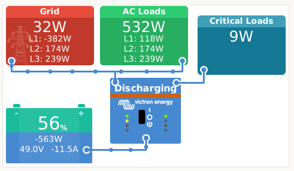
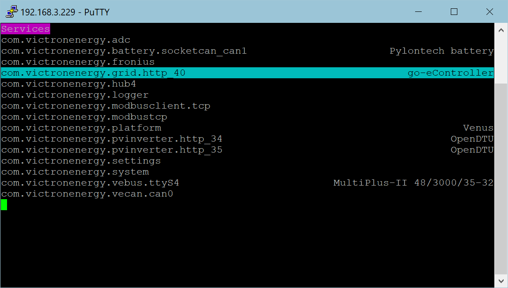
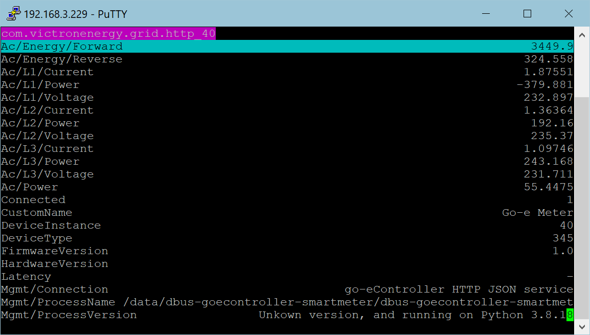

# dbus-goecontroller-smartmeter
dbus service to integrate go-e controller as a grid meter for [Victron Energies Venus OS](https://github.com/victronenergy/venus)

## Purpose
With the scripts in this repo you install, uninstall, restart a service that connects the go-e controller to the VenusOS and GX devices from Victron.

## Based on 
dbus-shelly-3em-smartmeter via https://github.com/fabian-lauer/dbus-shelly-3em-smartmeter

### Preconditions
  - go-econtroller with latest firmware 
  - 3-Phase grid
  - Victron Multiplus II and Cerbo GX with Venus OS - Firmware
  - No other devices from Victron Meter connected

### Script
- Runs as a service
- Connects to DBus of the Venus OS `com.victronenergy.grid.http_40`
- After successful DBus connection go-e controller is accessed via REST-API, using the first 3 sensors to calculate real power for L1, L2, L3 of the grid
- Paths are added to the DBus including some settings like name, etc
- After that a "loop" is started which pulls data every 750ms from the REST-API and updates the values in the DBus

### Pictures

cerbo console example



terminal command `dbus-spy`



terminal command `dbus-spy` - details



### Get the code
Grap a copy of the main branche and copy them to `/data/dbus-goecontroller-smartmeter`.

The following script should do everything for you:
```
wget https://github.com/checkomat/dbus-goecontroller-smartmeter/archive/refs/heads/main.zip
unzip main.zip "dbus-goecontroller-smartmeter-main/*" -d /data
mv /data/dbus-goecontroller-smartmeter-main /data/dbus-goecontroller-smartmeter
rm main.zip
```

### Change config.ini
Within the project there is a file `/data/dbus-goecontroller-smartmeter/config.ini` - just change the values - most important is the host, username and password in section "ONPREMISE". More details below:

| Section  | Config vlaue | Explanation |
| ------------- | ------------- | ------------- |
| DEFAULT  | SignOfLifeLog  | Time in minutes how often a status is added to the log-file `current.log` with log-level INFO |
| DEFAULT  | CustomName  | Name of your device - usefull if you want to run multiple versions of the script |
| DEFAULT  | DeviceInstance  | DeviceInstanceNumber e.g. 40 |
| DEFAULT  | LogLevel  | Define the level of logging - lookup: https://docs.python.org/3/library/logging.html#levels |
| ONPREMISE  | Host | IP or hostname of the go-e controller |
| ONPREMISE  | Serial | Serialnumber of the go-e controller |

### Step by step installation and debugging

#### Make executeable
```
chmod a+x /data/dbus-goecontroller-smartmeter/install.sh
```
#### Install (starts service and adds install.sh to rc.local)
```
/data/dbus-goecontroller-smartmeter/install.sh
```
####  Restart the service - e.g. after a config.ini change  
```
/data/dbus-opendtu/restart.sh
```
#### Look for service `com.victronenergy.grid.http_40` and check logfile
```
dbus-spy
```
#### View log file
```
cat /data/dbus-goecontroller-smartmeter/current.log
``` 
#### start script manually to find problems 
```
python /data/dbus-goecontroller-smartmeter/dbus-goecontroller-smartmeter.py
```

### Uninstall
```
/data/dbus-goecontroller-smartmeter/uninstall.sh
```

## Documentation
- https://github.com/victronenergy/venus/wiki/dbus#grid   DBus paths for Victron namespace GRID
- https://github.com/victronenergy/venus/wiki/dbus-api   DBus API from Victron
- https://www.victronenergy.com/live/ccgx:root_access   How to get root access on GX device/Venus OS
- https://github.com/victronenergy/venus/wiki/dbus#grid-and-genset-meter
- https://github.com/goecharger/go-eController-API/blob/main/apikeys-en.md
  

